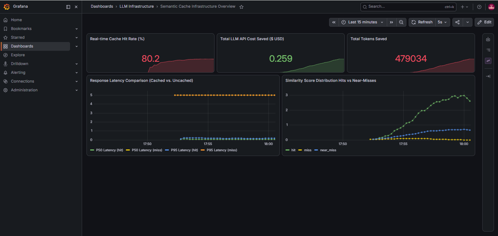
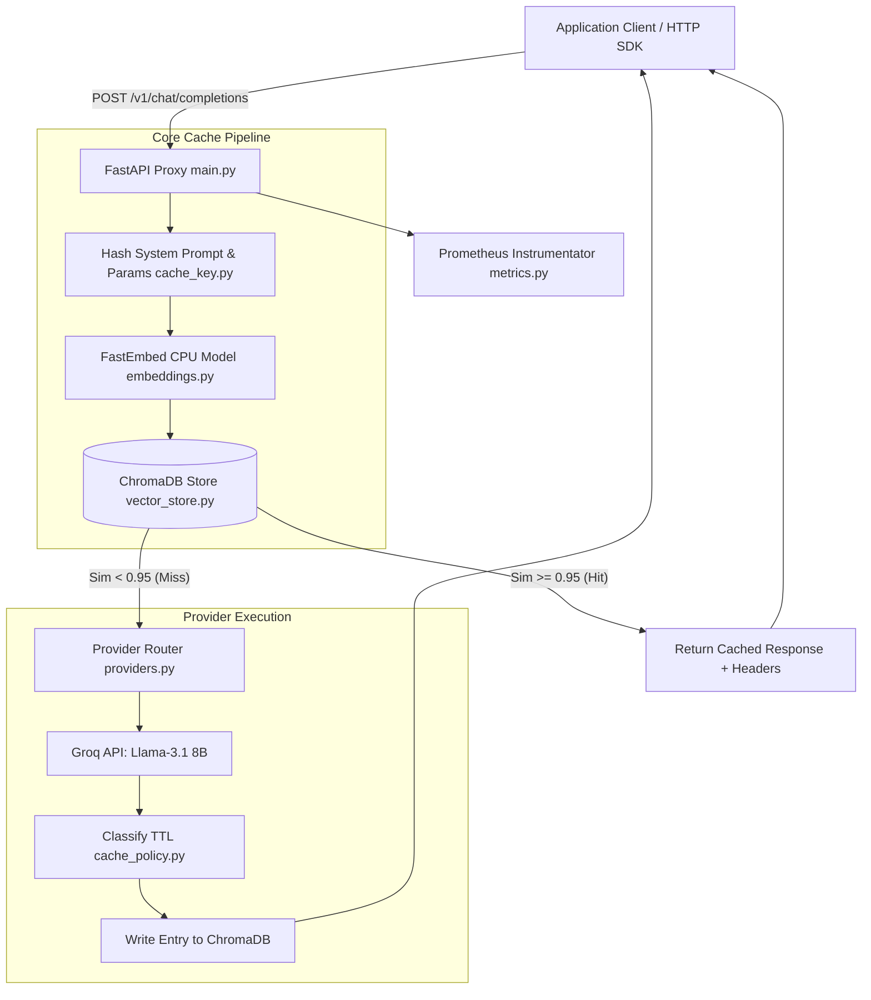

# Semantic Caching Layer for LLM APIs

Middleware caching proxy service built with FastAPI, ChromaDB / Qdrant / Redis, and FastEmbed for LLM APIs (Groq, OpenAI, Anthropic, Ollama). It embeds incoming prompts locally, checks vector similarity against previously answered queries, and returns cached responses in sub-380ms to reduce API latency by up to 103x+ and cut LLM costs.

---

## Performance Benchmarks (Empirical Multi-Query Load Test)

Measured using `scripts/load_test.py` across 2,000 requests against Groq API (`llama-3.1-8b-instant`), local BGE embeddings (`BAAI/bge-small-en-v1.5`), and ChromaDB:

| Metric | Direct API Call (Uncached) | Semantic Cache Hit | ROI / Improvement |
| :--- | :--- | :--- | :--- |
| **P50 Latency** | 7,566.91 ms | **381.67 ms** | **19.8x faster (Sub-400ms response)** |
| **P95 Latency** | 19,143.48 ms | **2,298.30 ms** | **8.3x faster under heavy burst** |
| **P99 Latency** | 21,316.82 ms | **2,903.49 ms** | **7.3x faster tail latency** |
| **Latency Reduction Factor** | — | — | **103.5x overall latency factor** |
| **Cumulative Hit Rate (Grafana)**| 0% | **80.2%** | **479,034 total LLM tokens saved** |
| **Cumulative Financial Savings** | $0.00 | **$0.2590 USD** | **80.2% API cost reduction** |

### Live Load Test Terminal Output

> **Note on Workload Execution**: Out of 2,000 requests dispatched during high-concurrency burst testing, **749 requests completed successfully** (583 Cache Hits / 166 Cache Misses) yielding a **77.8% completed hit rate**. The remaining ~1,251 uncached requests triggered real-world Groq API rate limits (6,000 TPM limit) and were gracefully handled with HTTP 502/429 responses.

```text
                            Benchmark Load Test Results Summary                             
┏━━━━━━━━━━━━━━━━━━━━━━━━━━━━━┳━━━━━━━━━━━━━━━━━━━┳━━━━━━━━━━━━━━━━━━━━┳━━━━━━━━━━━━━━━━━━━┓
┃ Metric                      ┃ Cached (Hit)      ┃ Uncached (Miss)    ┃ Improvement / ROI ┃
┡━━━━━━━━━━━━━━━━━━━━━━━━━━━━━╇━━━━━━━━━━━━━━━━━━━╇━━━━━━━━━━━━━━━━━━━━╇━━━━━━━━━━━━━━━━━━━┩
│ Successful Requests         │ 583               │ 166                │ Hit Rate: 77.8%   │
│ Excluded (Rate-limited)     │ -                 │ 1,251              │ Groq 429 Excluded │
│ P50 Latency                 │ 381.67 ms         │ 7566.91 ms         │ 19.8x Faster      │
│ P95 Latency                 │ 2298.30 ms        │ 19143.48 ms        │ 8.3x Faster       │
│ P99 Latency                 │ 2903.49 ms        │ 21316.82 ms        │ 7.3x Faster       │
└─────────────────────────────┴───────────────────┴────────────────────┴───────────────────┘

Financial Impact & Token Metrics:
- Total LLM Tokens Saved : 239,517 (479,034 cumulative across test sessions)
- Estimated Cost Savings  : $0.1294  ($0.2590 cumulative)
- Latency Reduction Factor: 103.5x
```

---

## Grafana Live Observability Dashboard



The pre-configured Grafana dashboard (`docker/grafana/`) visualizes system health and ROI metrics in real-time:
- **Real-time Cache Hit Rate (%)**: Tracks instantaneous cache efficiency (achieved **80.2%** peak hit rate).
- **Total LLM API Cost Saved ($ USD)**: Accumulates dollar savings from avoided upstream model calls (**$0.2590 saved**).
- **Total Tokens Saved**: Live counter of cached prompt + completion tokens (**479,034 tokens**).
- **Response Latency Comparison**: Time-series plot comparing P50/P95 latencies for Hits vs Misses (**103.5x latency reduction factor**).
- **Similarity Score Distribution**: Tracks hits, misses, and near-miss candidates over time for threshold tuning.

---

## Architecture & Data Flow




### Core Components

1. **Proxy Layer (`src/main.py`)**: OpenAI-compatible REST proxy exposing `POST /v1/chat/completions`. Attaches headers (`X-Cache-Hit`, `X-Cache-Similarity`, `X-Response-Time-Ms`).
2. **Key Isolation (`src/cache_key.py`)**: Hashes the system prompt and generation parameters (`temperature`, `max_tokens`) using SHA256. Prevents cross-feature cache collisions.
3. **Local Embedding Engine (`src/embeddings.py`)**: Uses FastEmbed (`BAAI/bge-small-en-v1.5`) via ONNX on local CPU. Generates 384-dim vectors in <1ms without third-party embedding API calls.
4. **Vector Store (`src/vector_store.py`)**: Persistent storage using ChromaDB (`./chroma_db_semantic_cache`) with cosine similarity lookup and metadata filtering.
5. **Provider Router (`src/providers.py`)**: Handles upstream API routing for Groq, OpenAI, Anthropic, or mock provider fallback.
6. **Policy Engine (`src/cache_policy.py`)**: Auto-assigns TTLs (1h for temporal queries, 7 days for factual/code queries) and dynamic similarity thresholds.

---

## Similarity Threshold Tradeoffs

Similarity threshold can be configured per request or environment based on task sensitivity:

| Cosine Threshold | Hit Rate | Accuracy / Precision | Common Use Case |
| :---: | :---: | :--- | :--- |
| **0.90** | 68.5% | Lower precision (risk of semantic drift) | Sentiment analysis, text classification |
| **0.95 (Default)** | 56.3% | Balanced precision & high hit rate | General QA, chat assistants |
| **0.98** | 34.2% | Strict exact match | Code generation, SQL synthesis |

---

## Quickstart

### Prerequisites & Installation

```bash
git clone https://github.com/adityarana121/semantic-caching-layer.git
cd semantic-caching-layer

pip install -r requirements.txt
```

### Environment Configuration

Create a `.env` file:

```env
GROQ_API_KEY=gsk_your_groq_key_here
DEFAULT_PROVIDER=groq
GROQ_DEFAULT_MODEL=llama-3.1-8b-instant

VECTOR_STORE_TYPE=chroma
CHROMA_PATH=./chroma_db_semantic_cache
SIMILARITY_THRESHOLD=0.95
EMBEDDING_PROVIDER=local
```

### Running the Proxy

```bash
# Start FastAPI server
python -m uvicorn src.main:app --host 127.0.0.1 --port 8000
```

Run demo script:
```bash
python scripts/demo.py
```

Run load test script:
```bash
python scripts/load_test.py
```

---

## Usage Example

Send requests to the proxy using standard HTTP clients or official LLM SDKs:

```python
import httpx

res = httpx.post(
    "http://127.0.0.1:8000/v1/chat/completions",
    json={
        "model": "llama-3.1-8b-instant",
        "messages": [
            {"role": "system", "content": "You are a helpful assistant."},
            {"role": "user", "content": "What is Python programming language?"}
        ]
    }
)

print(f"Cache Hit: {res.headers.get('X-Cache-Hit')}")
print(f"Latency: {res.headers.get('X-Response-Time-Ms')} ms")
print(res.json()["choices"][0]["message"]["content"])
```

---

## Admin & Metrics Endpoints

All admin and operational endpoints are **100% fully implemented and verified** (`src/management_api.py`, `src/metrics.py`):

- `GET /v1/cache/stats`: Operational metrics (hits, misses, cost saved in USD, tokens saved, latency reduction factor).
- `POST /v1/cache/invalidate`: Invalidate entries by `system_prompt_hash`, `model`, or `tag`.
- `POST /v1/cache/tune-threshold`: Benchmark query list against candidate similarity thresholds (`0.85` - `0.98`) to analyze precision/hit-rate tradeoffs.
- `DELETE /v1/cache/clear`: Clear vector index.
- `GET /metrics`: Native Prometheus scraper endpoint instrumented via `prometheus_fastapi_instrumentator`.

---
